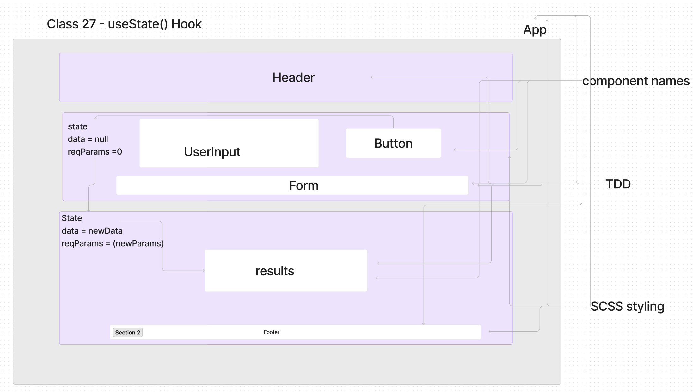
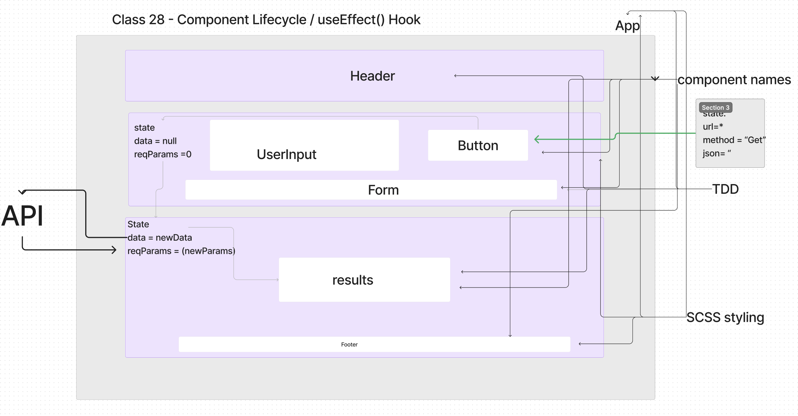

# Component Based UI

## LAB - Class 28

### Author: Coriana Williams

### Problem Domain# Phase 1 Requirements
Today, we begin the first of a 4-Phase build of the RESTy application, written in React. In this first phase, our goal is to setup the basic scaffolding of the application, with intent being to add more functionality to the system as we go. This initial build sets up the file structure so that we can progressively build this application in a scalable manner.

Phase 2 Requirements
In phase 2, we will be receiving user input in preparation of connecting to live APIs, using the useState() hook in our functional components. In order to properly manage state with the useState hook, we will now convert <App /> to a functional component.

Phase 3 Requirements
In phase 3, we will be connecting RESTy to live APIs, fetching and displaying remote data. Our primary focus will be to service GET requests.

### Links and Resources
- ![Sandbox URL1 - class 26](https://codesandbox.io/p/github/Coriana1/resty/main?layout=%257B%2522sidebarPanel%2522%253A%2522EXPLORER%2522%252C%2522rootPanelGroup%2522%253A%257B%2522direction%2522%253A%2522horizontal%2522%252C%2522type%2522%253A%2522PANEL_GROUP%2522%252C%2522id%2522%253A%2522ROOT_LAYOUT%2522%252C%2522panels%2522%253A%255B%257B%2522type%2522%253A%2522PANEL_GROUP%2522%252C%2522direction%2522%253A%2522horizontal%2522%252C%2522id%2522%253A%2522EDITOR%2522%252C%2522panels%2522%253A%255B%257B%2522type%2522%253A%2522PANEL%2522%252C%2522panelType%2522%253A%2522TABS%2522%252C%2522id%2522%253A%2522clj6afjvj000b3b6m95pm6ep3%2522%257D%255D%252C%2522sizes%2522%253A%255B100%255D%257D%252C%257B%2522type%2522%253A%2522PANEL_GROUP%2522%252C%2522direction%2522%253A%2522horizontal%2522%252C%2522id%2522%253A%2522DEVTOOLS%2522%252C%2522panels%2522%253A%255B%257B%2522type%2522%253A%2522PANEL%2522%252C%2522panelType%2522%253A%2522TABS%2522%252C%2522id%2522%253A%2522clj6afjvj000d3b6mh9v3wk58%2522%257D%255D%252C%2522sizes%2522%253A%255B100%255D%257D%255D%252C%2522sizes%2522%253A%255B50%252C50%255D%257D%252C%2522tabbedPanels%2522%253A%257B%2522clj6afjvj000b3b6m95pm6ep3%2522%253A%257B%2522tabs%2522%253A%255B%257B%2522id%2522%253A%2522clj6afjvi000a3b6mwiy8xt07%2522%252C%2522mode%2522%253A%2522permanent%2522%252C%2522type%2522%253A%2522FILE%2522%252C%2522filepath%2522%253A%2522%252FREADME.md%2522%257D%255D%252C%2522id%2522%253A%2522clj6afjvj000b3b6m95pm6ep3%2522%252C%2522activeTabId%2522%253A%2522clj6afjvi000a3b6mwiy8xt07%2522%257D%252C%2522clj6afjvj000d3b6mh9v3wk58%2522%253A%257B%2522id%2522%253A%2522clj6afjvj000d3b6mh9v3wk58%2522%252C%2522activeTabId%2522%253A%2522clj6ag7k000b23b6mxc58qvie%2522%252C%2522tabs%2522%253A%255B%257B%2522type%2522%253A%2522TASK_LOG%2522%252C%2522taskId%2522%253A%2522start%2522%252C%2522id%2522%253A%2522clj6ag7k000b23b6mxc58qvie%2522%252C%2522mode%2522%253A%2522permanent%2522%257D%252C%257B%2522type%2522%253A%2522TASK_PORT%2522%252C%2522taskId%2522%253A%2522start%2522%252C%2522port%2522%253A3000%252C%2522id%2522%253A%2522clj6age1i00fb3b6mv0u32klt%2522%252C%2522mode%2522%253A%2522permanent%2522%252C%2522path%2522%253A%2522%2522%257D%255D%257D%257D%252C%2522showDevtools%2522%253Atrue%252C%2522showSidebar%2522%253Atrue%252C%2522sidebarPanelSize%2522%253A15%257D)

- ![Sandbox URL2 - class 27](https://codesandbox.io/p/github/Coriana1/resty/main?layout=%257B%2522sidebarPanel%2522%253A%2522EXPLORER%2522%252C%2522rootPanelGroup%2522%253A%257B%2522direction%2522%253A%2522horizontal%2522%252C%2522type%2522%253A%2522PANEL_GROUP%2522%252C%2522id%2522%253A%2522ROOT_LAYOUT%2522%252C%2522panels%2522%253A%255B%257B%2522type%2522%253A%2522PANEL_GROUP%2522%252C%2522direction%2522%253A%2522horizontal%2522%252C%2522id%2522%253A%2522EDITOR%2522%252C%2522panels%2522%253A%255B%257B%2522type%2522%253A%2522PANEL%2522%252C%2522panelType%2522%253A%2522TABS%2522%252C%2522id%2522%253A%2522clj6afjvj000b3b6m95pm6ep3%2522%257D%255D%252C%2522sizes%2522%253A%255B100%255D%257D%252C%257B%2522type%2522%253A%2522PANEL_GROUP%2522%252C%2522direction%2522%253A%2522horizontal%2522%252C%2522id%2522%253A%2522DEVTOOLS%2522%252C%2522panels%2522%253A%255B%257B%2522type%2522%253A%2522PANEL%2522%252C%2522panelType%2522%253A%2522TABS%2522%252C%2522id%2522%253A%2522clj6afjvj000d3b6mh9v3wk58%2522%257D%255D%252C%2522sizes%2522%253A%255B100%255D%257D%255D%252C%2522sizes%2522%253A%255B50%252C50%255D%257D%252C%2522tabbedPanels%2522%253A%257B%2522clj6afjvj000b3b6m95pm6ep3%2522%253A%257B%2522id%2522%253A%2522clj6afjvj000b3b6m95pm6ep3%2522%252C%2522tabs%2522%253A%255B%257B%2522id%2522%253A%2522clj6afjvi000a3b6mwiy8xt07%2522%252C%2522mode%2522%253A%2522permanent%2522%252C%2522type%2522%253A%2522FILE%2522%252C%2522filepath%2522%253A%2522%252FREADME.md%2522%252C%2522state%2522%253A%2522IDLE%2522%257D%252C%257B%2522type%2522%253A%2522EMPTY_DEVTOOL%2522%252C%2522id%2522%253A%2522clj6glra501xd3b6my4xjb8aj%2522%252C%2522mode%2522%253A%2522permanent%2522%257D%255D%252C%2522activeTabId%2522%253A%2522clj6afjvi000a3b6mwiy8xt07%2522%257D%252C%2522clj6afjvj000d3b6mh9v3wk58%2522%253A%257B%2522id%2522%253A%2522clj6afjvj000d3b6mh9v3wk58%2522%252C%2522tabs%2522%253A%255B%257B%2522type%2522%253A%2522TASK_LOG%2522%252C%2522taskId%2522%253A%2522start%2522%252C%2522id%2522%253A%2522clj6ag7k000b23b6mxc58qvie%2522%252C%2522mode%2522%253A%2522permanent%2522%257D%252C%257B%2522type%2522%253A%2522TASK_PORT%2522%252C%2522taskId%2522%253A%2522start%2522%252C%2522port%2522%253A3000%252C%2522id%2522%253A%2522clj6age1i00fb3b6mv0u32klt%2522%252C%2522mode%2522%253A%2522permanent%2522%252C%2522path%2522%253A%2522%2522%257D%255D%252C%2522activeTabId%2522%253A%2522clj6ag7k000b23b6mxc58qvie%2522%257D%257D%252C%2522showDevtools%2522%253Atrue%252C%2522showSidebar%2522%253Atrue%252C%2522sidebarPanelSize%2522%253A15%257D) 

- 
## Collaborators
Kenya Womack, Ryan, Tony (TA)

### Setup
#### `.env` requirements (where applicable)
for now I have none and do not require one
#### How to initialize/run your application (where applicable)
- e.g. `npm start`
#### How to use your library (where applicable)
#### Features / Routes
- Feature One: Details of feature
- GET : `/hello` - specific route to hit
#### Tests
- npm test
#### UML

